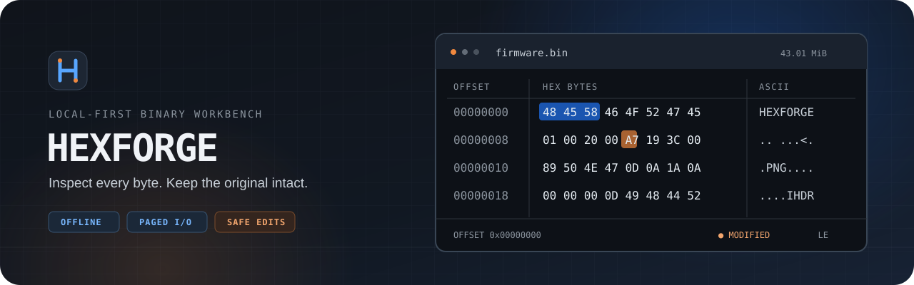

<h1 align="center">HexForge</h1>

<p align="center"><strong>A modern, local-first hex viewer for understanding binary files.</strong></p>

<p align="center">🔒 Fully offline &nbsp;·&nbsp; ⚡ Paginated for large files &nbsp;·&nbsp; 🛡️ Original-safe editing</p>

<p align="center">
  
</p>

<p align="center"><sub>Illustrated preview · Tauri 2 + Vue 3 + TypeScript + Rust + a hand-drawn Canvas hex view</sub></p>

## ✨ Why HexForge

| Capability | Why it helps |
| --- | --- |
| **🔍 Inspect at scale** | Open any local binary, including `.bin`, `.rom`, and `.raw`. Rust loads bounded pages near the visible viewport, not the whole multi-gigabyte file. The Canvas view shows offsets, hex bytes, and printable ASCII; other bytes appear as `.`. |
| **🎯 Find the bytes that matter** | Select a byte or drag a range, jump to decimal or `0x` offsets, search patterns such as `41 42 43`, and switch between 16 and 32 bytes per row. |
| **🛡️ Edit without risk to the source** | Change validated `00`–`FF` values in an in-memory buffer. Orange marks edited bytes; Undo rolls changes back. Binary Save As writes a new file—never over the original. |
| **🧩 Turn bytes into fields** | Create or load local JSON templates, parse them in either byte order, and inspect results below the hex view. Click a result to highlight its bytes, or export the table as CSV. |

Search, parsing, Save As, and export run without blocking the interface and report progress. HexForge starts in a dark theme, offers a light theme, and bundles JetBrains Mono locally.

> [!NOTE]
> HexForge does not upload your files, bytes, paths, templates, or parsed results. The desktop app has no telemetry, updater, or runtime network client.

## 🚀 Get started

### Windows portable build

The [build workflow](.github/workflows/build.yaml) uploads a `HexForge-windows-x64-portable` artifact after a successful run. In [GitHub Actions](https://github.com/Steven-w65/HexForge/actions), open a successful **Build Portable Windows EXE** run, download and extract the artifact, then launch `hexforge.exe`. There is no HexForge installer; Windows still needs the WebView2 runtime used by Tauri.

### Run from source

Install a compatible Node.js version (`^20.19.0` or `>=22.12.0`), npm (the project specifies `11.6.3`), stable Rust, and the [Tauri 2 platform prerequisites](https://v2.tauri.app/start/prerequisites/). Windows development also requires Microsoft C++ Build Tools and WebView2.

```sh
npm ci
npm run tauri -- dev
```

To build the portable Windows executable yourself:

```sh
npm run tauri -- build --no-bundle
```

The result is `src-tauri/target/release/hexforge.exe`.

## 🛡️ Original-safe by design

> [!IMPORTANT]
> The active binary is opened read-only. **Save As is the only binary save operation**: it writes the source plus in-memory edits to a brand-new path and refuses both the original path and an existing destination.

The new copy stays open after Save As, so the saved bytes remain visible. The status bar shows your selected offset and byte, selection size, row width, edit mode, endianness, and modified state. Closing with unsaved changes asks for confirmation. HexForge has Undo, but no Redo.

## 🧩 Parsing templates

Templates are independent local JSON files. **Loading a template does not open a binary or apply the template.** You choose when to parse.

1. Open a binary with **File → Open File…** or drag and drop it into HexForge.
2. Choose **Template → Load Template…**, or open the separate **Template Editor…** window to create an Untitled template.
3. Add fields and choose **Apply Template**. You can apply an unsaved editor draft without first writing a JSON file.
4. Inspect results below the hex view. Click a row to navigate to and highlight its byte range.

The editor's **Save Template** updates a path-backed JSON file; **Save Template As…** chooses a path. Saving does not auto-apply. **Unload Template** clears the active template, and unsaved drafts are protected on close.

| Numeric | Fixed-length |
| --- | --- |
| `u8` · `u16` · `u32` · `i8` · `i16` · `i32` · `f32` · `f64` | `string` · `bytes` |

Fields support decimal or `0x`-prefixed offsets; numeric fields support little- and big-endian decoding. Templates are flat by design—there are no nested structures or conditional rules. Parsing is capped at 4,096 fields and a 16 MiB aggregate decoded-data budget.

**Try a sample:** [PNG / IHDR header](templates/png-header.json) · [Firmware header](templates/firmware-header.json)

## ⌨️ Keyboard shortcuts

| Action | Shortcut |
| --- | --- |
| Open / close binary file | `Ctrl+O` / `Ctrl+W` |
| Save binary as a new file | `Ctrl+Alt+S` |
| Export parsed results as CSV | `Ctrl+Shift+E` |
| Toggle edit mode / edit selected byte / undo | `Ctrl+Alt+E` / `F2` / `Ctrl+Z` |
| Go to offset / search bytes | `Ctrl+G` / `Ctrl+F` |
| Open Template Editor / apply template | `Ctrl+Shift+T` / `Ctrl+Enter` |
| Load / unload template | `Ctrl+Alt+O` / `Ctrl+Alt+U` |
| Save template / Save Template As | `Ctrl+S` / `Ctrl+Shift+S` |
| Toggle dark/light theme | `Ctrl+Alt+T` |
| Set 16 / 32 bytes per row | `Ctrl+1` / `Ctrl+2` |
| Close a popup, or clear selection | `Esc` |
| Exit | `Alt+F4` |

`Ctrl+S` saves the **template JSON**, not the binary. For binary output, use Save As.

## 🛠️ For contributors

Vue and TypeScript own the interface and layered Canvas renderer. Tauri commands connect it to Rust's paginated I/O, search, template parser, CSV export, and sparse edit buffer. No third-party hex-view component is used.

```sh
npm test
npm run typecheck
npm run build
cargo test --manifest-path src-tauri/Cargo.toml
```

Dependencies are locked in `package-lock.json`. Use `npm ci` for a fresh checkout and `npm install` only when intentionally updating them.
