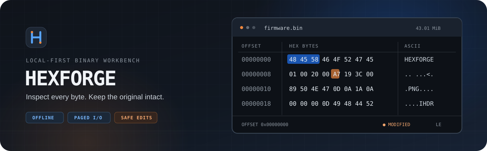

<h1 align="center">HexForge</h1>

<p align="center"><strong>Inspect bytes. Understand structure. Keep the original intact.</strong></p>

<p align="center">A fast, fully offline hex viewer and binary analysis tool for Windows.</p>

<p align="center">
  <a href="https://github.com/Steven-w65/HexForge/actions/workflows/build.yaml">⬇️ Get the portable EXE</a>
  &nbsp;·&nbsp;
  <a href="#start-here">🚀 Get started</a>
  &nbsp;·&nbsp;
  <a href="#templates">🧩 Explore templates</a>
</p>

<p align="center">
  
</p>

<p align="center"><sub>Illustrated interface preview · Built with Tauri 2, Vue 3, TypeScript, Rust, and Canvas</sub></p>

## What you can do

- 🔬 **Inspect without loading everything.** Open any local binary file. Rust reads bounded pages around the viewport, so even multi-gigabyte files stay practical to explore. The Canvas view keeps offsets, hex bytes, and ASCII side by side; non-printable characters appear as `.`.
- 🧭 **Get to the right bytes quickly.** Jump to decimal or `0x` offsets, search hex sequences such as `41 42 43`, select byte ranges, and switch between 16 and 32 bytes per row. A minimap helps you keep your place in the file.
- ✏️ **Experiment without touching the source.** Edit a selected byte in memory, see changes highlighted in orange, and undo an edit. **Save As** writes a new binary; the original is never overwritten.
- 🧩 **Make structure visible.** Apply a local JSON template to decode fields, jump from a parsed result to its bytes, and export results as CSV.

The interface follows your system's light or dark theme automatically and bundles JetBrains Mono locally. Toggle Theme (`Ctrl+Alt+T`) keeps a manual choice until the next system-theme change or app restart. Search, parsing, and export keep the interface responsive.

Everything stays local: HexForge never uploads your files, bytes, paths, templates, or parsed results. There are no cloud accounts, telemetry, or auto-updates.

## Start here

### Use the portable Windows build

1. Open the [Build Portable Windows EXE workflow](https://github.com/Steven-w65/HexForge/actions/workflows/build.yaml) and choose a successful run.
2. Download and extract the **`HexForge-windows-x64-portable`** artifact.
3. Launch `hexforge.exe`, then use **File → Open File…** or drag a binary into the window.

There is no HexForge installer or development server to run. Windows needs the WebView2 runtime used by Tauri.

### Run from source

Install Node.js compatible with [`package.json`](package.json) (`^20.19.0` or `>=22.12.0`), npm, stable Rust, and the [Tauri 2 platform prerequisites](https://v2.tauri.app/start/prerequisites/). On Windows, this includes Microsoft C++ Build Tools and WebView2.

```sh
npm ci
npm run tauri -- dev
```

To create the portable executable locally:

```sh
npm run tauri -- build --no-bundle
```

The output is `src-tauri/target/release/hexforge.exe`.

## Your original file stays original

> [!IMPORTANT]
> HexForge opens the source binary read-only. Edits live in an in-memory buffer. **Save As is the only way to write binary changes**, and it refuses both the source path and an existing destination.

After Save As, HexForge opens the new copy so the bytes you just saved remain visible. Unsaved edits are marked as modified, and closing prompts before discarding them. The status bar keeps the selected offset and byte, selection length, row width, edit mode, and parse endianness in view.

There is **Undo**, but no Redo or in-place Save overwrite.

## Templates

A template is an independent local JSON file. **Loading a template is not the same as opening a binary, and neither action applies the template automatically.**

1. Open a binary file.
2. Choose **Template → Load Template…**, or open **Template Editor…** to create an Untitled template.
3. Add fields in the separate editor and choose **Apply Template**. You can preview an unsaved draft without first saving its JSON.
4. Read the parsed results below the hex view. Click a row to jump to and highlight its byte range.

- **Types:** signed and unsigned 8/16/32/64-bit integers, `f32`, `f64`, `bool`, encoded `string`, and `bytes`.
- **Structure:** ordered fields, nested structures, arrays, typed conditions, enum labels, bit flags, and exact decimal offsets. Numeric fields support little- or big-endian decoding.
- **Safety:** bounded reads and expansion, with diagnostics beside affected fields. Parsing uses the current in-memory bytes, including unsaved edits.

**Save Template** updates an already path-backed JSON file; **Save Template As…** chooses a path. Saving never auto-applies. You can unload a template, and the editor protects unsaved drafts when it closes.

Start with the [PNG / IHDR](templates/png-ihdr.json), [RIFF/WAV](templates/riff-wav.json), or [ELF64](templates/elf64-header.json) examples and their matching fixtures. The [bundled template catalog](templates/README.md#bundled-examples) also covers BMP, GIF, ICO, DDS, ZIP, GZIP, SQLite, PCAP in both byte orders, GLB, and UF2, with each template's coverage and limitations documented.

The [template-format guide](templates/README.md) explains the one supported JSON format and its limits. Old JSON files with a top-level `version` property are unsupported; recreate them manually in the Template Editor. HexForge never converts them automatically.

<details>
<summary><strong>⌨️ Keyboard shortcuts</strong></summary>

| Action | Shortcut |
| --- | --- |
| Open / close binary | `Ctrl+O` / `Ctrl+W` |
| Save binary as a new file | `Ctrl+Alt+S` |
| Go to offset / search bytes | `Ctrl+G` / `Ctrl+F` |
| Toggle edit mode / edit selected byte / undo | `Ctrl+Alt+E` / `F2` / `Ctrl+Z` |
| Open Template Editor / apply template | `Ctrl+Shift+T` / `Ctrl+Enter` |
| Load / unload template | `Ctrl+Alt+O` / `Ctrl+Alt+U` |
| Save template / Save Template As | `Ctrl+S` / `Ctrl+Shift+S` |
| Export parsed results as CSV | `Ctrl+Shift+E` |
| Toggle dark / light theme | `Ctrl+Alt+T` |
| Use 16 / 32 bytes per row | `Ctrl+1` / `Ctrl+2` |
| Close a popup or clear selection | `Esc` |
| Exit | `Alt+F4` |

`Ctrl+S` saves the **template JSON**, not the binary. Use **Save As** for binary output.

</details>

## Build and verify

Vue and TypeScript handle the interface and layered Canvas rendering. Tauri commands connect it to Rust's paginated I/O, search, template parser, CSV export, and sparse in-memory edit buffer. HexForge does not use a third-party hex-view component.

```sh
npm ci
npm test
npm run typecheck
npm run build
cargo test --manifest-path src-tauri/Cargo.toml
```

On Windows with Microsoft Edge installed, `npm run test:canvas:real` also checks real Canvas rendering and Template Editor dialog styling. The [Windows build workflow](.github/workflows/build.yaml) runs the checks, builds a portable `.exe`, and verifies that its bundled interface starts without a development server.
